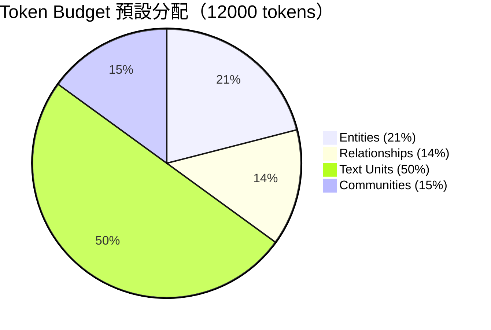
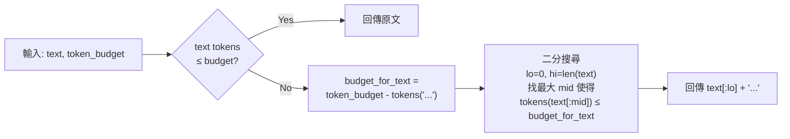
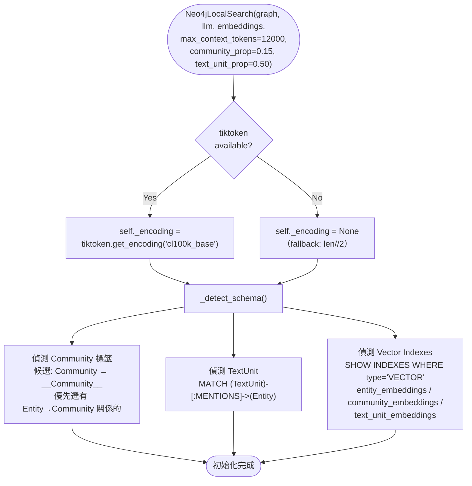
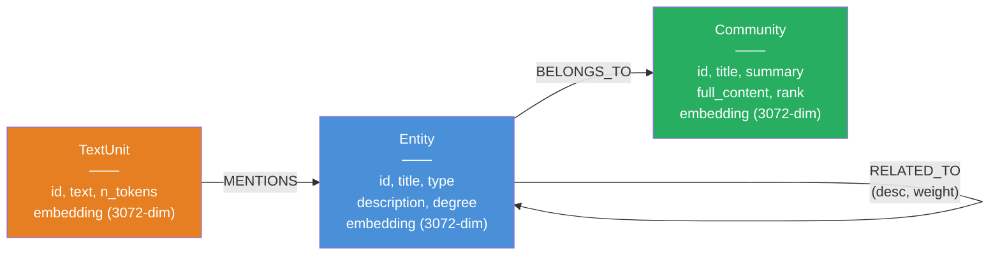

# Neo4j Local Search 流程圖

## 完整搜尋流程（search()）

```mermaid
flowchart TD
    START(["search(question, max_hops=2, max_context_tokens=12000)"])
    START --> INIT["初始化參數<br/>ctx_tokens = max_context_tokens<br/>community_prop / text_unit_prop"]

    %% ===== Step 1 =====
    INIT --> S1_TITLE["<b>[1/5] Entity Vector Search</b>"]
    S1_TITLE --> S1_CHECK{has_vector_index?}

    S1_CHECK -- Yes --> S1_VS["find_entities_by_vector_search()<br/>───────────────<br/>1. embed_query(question) → 3072-dim<br/>2. db.index.vector.queryNodes<br/>   ('entity_embeddings', top_k=10)<br/>3. WHERE score > 0.7<br/>4. RETURN id, title, type, desc, degree, score"]
    S1_VS --> S1_RESULT{找到實體？}

    S1_CHECK -- No --> S1_FALLBACK
    S1_RESULT -- No --> S1_FALLBACK

    S1_FALLBACK["Fallback: 文字匹配<br/>───────────────<br/>1. extract_entities_from_question()<br/>   （LLM call → JSON 實體列表）<br/>2. find_matching_entities_in_neo4j()<br/>   精確匹配 → 模糊匹配 → 高度數節點"]
    S1_FALLBACK --> S1_RESULT2{找到實體？}
    S1_RESULT2 -- No --> ABORT["回傳: 未找到相關實體，無法回答問題。"]
    S1_RESULT2 -- Yes --> S1_IDS
    S1_RESULT -- Yes --> S1_IDS

    S1_IDS["entity_ids = matched_entities 的 ID 列表"]

    %% ===== Step 2 =====
    S1_IDS --> S2_TITLE["<b>[2/5] Community Vector Search</b>"]
    S2_TITLE --> S2_CHECK{has_community_vector?}

    S2_CHECK -- Yes --> S2_VS["find_communities_by_vector_search()<br/>───────────────<br/>1. embed_query(question) → 3072-dim<br/>2. db.index.vector.queryNodes<br/>   ('community_embeddings', top_k=5)<br/>3. WHERE score > 0.7<br/>4. RETURN id, title, summary,<br/>   full_content, rank, score"]
    S2_VS --> S3_TITLE
    S2_CHECK -- No --> S2_SKIP["跳過（無 community_embeddings 索引）"]
    S2_SKIP --> S3_TITLE

    %% ===== Step 3 =====
    S3_TITLE["<b>[3/5] Graph Enrichment</b>"]
    S3_TITLE --> S3_ENRICH["get_enriched_context(entity_ids, max_hops)<br/>───────────────<br/>從種子實體 N-hop 擴展<br/>收集 4 類資料:"]
    S3_ENRICH --> S3_SUB1["Entities<br/>MATCH (start)-[:RELATED_TO*1..N]-(neighbor)<br/>回傳所有 distinct 實體"]
    S3_ENRICH --> S3_SUB2["Relationships<br/>MATCH (src)-[r:RELATED_TO]-(tgt)<br/>WHERE both IN all_nodes<br/>回傳 source, target, desc, weight"]
    S3_ENRICH --> S3_SUB3["TextUnits<br/>(tu)<-[:MENTIONS]-(TextUnit)<br/>按 mention 頻率 DESC<br/>LIMIT 5"]
    S3_ENRICH --> S3_SUB4["Community Reports（圖遍歷）<br/>(node)-[:BELONGS_TO]->(Community)<br/>WHERE summary IS NOT NULL<br/>ORDER BY rank DESC, LIMIT 5"]

    S3_SUB1 --> S3_MERGE
    S3_SUB2 --> S3_MERGE
    S3_SUB3 --> S3_MERGE
    S3_SUB4 --> S3_MERGE

    S3_MERGE["合併資料<br/>───────────────<br/>1. 種子實體加入 context.entities（去重）<br/>2. Vector 社群 + 圖遍歷社群合併（去重）<br/>3. 社群按 score↓ → rank↓ 排序"]

    %% ===== Step 4 =====
    S3_MERGE --> S4_TITLE["<b>[4/5] Token-Budgeted 格式化</b>"]
    S4_TITLE --> S4_BUDGET["預算分配（預設 12000 tokens）<br/>───────────────<br/>community_budget = 12000 × 0.15 = 1800<br/>text_unit_budget = 12000 × 0.50 = 6000<br/>local_budget = 12000 - 1800 - 6000 = 4200<br/>entity_budget = 4200 × 0.6 = 2520<br/>rel_budget = 4200 - 2520 = 1680"]

    S4_BUDGET --> S4_FMT1
    S4_BUDGET --> S4_FMT2
    S4_BUDGET --> S4_FMT3
    S4_BUDGET --> S4_FMT4

    S4_FMT1["_format_entities()<br/>budget: 2520 tokens<br/>───────────────<br/>排序: score↓ → degree↓<br/>逐筆加入 markdown 表格行<br/>累計 tokens 超過 budget 即停"]
    S4_FMT2["_format_relationships()<br/>budget: 1680 tokens<br/>───────────────<br/>排序: weight↓<br/>逐筆加入 markdown 表格行<br/>累計 tokens 超過 budget 即停"]
    S4_FMT3["_format_text_units()<br/>budget: 6000 tokens<br/>───────────────<br/>保持原順序（mention 頻率）<br/>逐段加入，超過 budget 時<br/>嘗試截斷最後一段<br/>（_truncate_text_to_budget 二分搜尋）"]
    S4_FMT4["_format_communities()<br/>budget: 1800 tokens<br/>───────────────<br/>排序: score↓ → rank↓<br/>優先 full_content，fallback summary<br/>超過 budget 時截斷最後一篇"]

    S4_FMT1 --> S4_CONCAT
    S4_FMT2 --> S4_CONCAT
    S4_FMT3 --> S4_CONCAT
    S4_FMT4 --> S4_CONCAT

    S4_CONCAT["拼接 context_data<br/>= entities + relationships + text_units + communities<br/>印出 token 使用統計"]

    %% ===== Step 5 =====
    S4_CONCAT --> S5_TITLE["<b>[5/5] LLM 生成回答</b>"]
    S5_TITLE --> S5_PROMPT["組裝 Prompt<br/>───────────────<br/>---Role--- 你是資料助手<br/>---Data tables--- {context_data}<br/>---User Question--- {question}<br/>---Response--- 繁體中文 Markdown + 引用"]
    S5_PROMPT --> S5_LLM["LLM (AzureChatOpenAI)<br/>ChatPromptTemplate | llm | StrOutputParser"]
    S5_LLM --> DONE(["回傳 answer"])

    %% ===== Styling =====
    classDef stepTitle fill:#4a90d9,color:#fff,font-weight:bold
    classDef decision fill:#f5a623,color:#fff
    classDef process fill:#e8f4fd,stroke:#4a90d9
    classDef budget fill:#d5f5e3,stroke:#27ae60
    classDef format fill:#fdebd0,stroke:#e67e22
    classDef abort fill:#f5b7b1,stroke:#e74c3c

    class S1_TITLE,S2_TITLE,S3_TITLE,S4_TITLE,S5_TITLE stepTitle
    class S1_CHECK,S1_RESULT,S1_RESULT2,S2_CHECK decision
    class S1_VS,S1_FALLBACK,S2_VS,S3_ENRICH,S3_MERGE,S5_PROMPT,S5_LLM process
    class S4_BUDGET budget
    class S4_FMT1,S4_FMT2,S4_FMT3,S4_FMT4,S4_CONCAT format
    class ABORT abort
```

## Token 預算分配圖

```mermaid
pie title Token Budget 預設分配（12000 tokens）
    "Entities (21%)" : 2520
    "Relationships (14%)" : 1680
    "Text Units (50%)" : 6000
    "Communities (15%)" : 1800
```

## 截斷策略：_truncate_text_to_budget()

```mermaid
flowchart LR
    IN["輸入: text, token_budget"] --> CHECK{text tokens<br/>≤ budget?}
    CHECK -- Yes --> RETURN_FULL["回傳原文"]
    CHECK -- No --> CALC["budget_for_text =<br/>token_budget - tokens('...')"]
    CALC --> BSEARCH["二分搜尋<br/>lo=0, hi=len(text)<br/>找最大 mid 使得<br/>tokens(text[:mid]) ≤ budget_for_text"]
    BSEARCH --> RESULT["回傳 text[:lo] + '...'"]
```

## 初始化流程（__init__）

```mermaid
flowchart TD
    INIT_START(["Neo4jLocalSearch(graph, llm, embeddings,<br/>max_context_tokens=12000,<br/>community_prop=0.15, text_unit_prop=0.50)"])
    INIT_START --> TIKTOKEN{"tiktoken<br/>available?"}
    TIKTOKEN -- Yes --> ENC["self._encoding =<br/>tiktoken.get_encoding('cl100k_base')"]
    TIKTOKEN -- No --> ENC_NONE["self._encoding = None<br/>（fallback: len//2）"]
    ENC --> SCHEMA
    ENC_NONE --> SCHEMA

    SCHEMA["_detect_schema()"]
    SCHEMA --> SCHEMA_C["偵測 Community 標籤<br/>候選: Community → __Community__<br/>優先選有 Entity→Community 關係的"]
    SCHEMA --> SCHEMA_T["偵測 TextUnit<br/>MATCH (TextUnit)-[:MENTIONS]->(Entity)"]
    SCHEMA --> SCHEMA_V["偵測 Vector Indexes<br/>SHOW INDEXES WHERE type='VECTOR'<br/>entity_embeddings / community_embeddings /<br/>text_unit_embeddings"]

    SCHEMA_C --> READY
    SCHEMA_T --> READY
    SCHEMA_V --> READY
    READY(["初始化完成"])
```

## Neo4j 資料模型

```mermaid
graph LR
    E["Entity<br/>───<br/>id, title, type<br/>description, degree<br/>embedding (3072-dim)"]
    C["Community<br/>───<br/>id, title, summary<br/>full_content, rank<br/>embedding (3072-dim)"]
    T["TextUnit<br/>───<br/>id, text, n_tokens<br/>embedding (3072-dim)"]

    E -- "RELATED_TO<br/>(desc, weight)" --> E
    E -- "BELONGS_TO" --> C
    T -- "MENTIONS" --> E

    style E fill:#4a90d9,color:#fff
    style C fill:#27ae60,color:#fff
    style T fill:#e67e22,color:#fff
```
